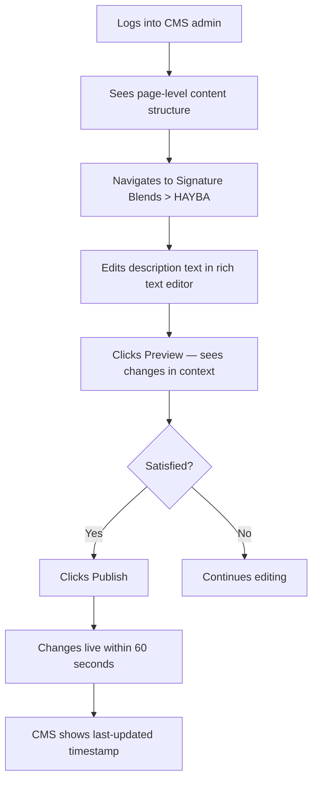

---
stepsCompleted:
  - 1
  - 2
  - 3
  - 4
  - 5
  - 6
  - 7
  - 8
  - 9
  - 10
  - 11
  - 12
  - 13
  - 14
inputDocuments:
  - '_bmad-output/planning-artifacts/prd.md'
  - '_bmad-output/planning-artifacts/prd-validation-report.md'
lastStep: 14
---

# UX Design Specification — QADIR Montreal

**Author:** Mqxerrormac16
**Date:** 2026-02-12

---

## Executive Summary

### Project Vision

QADIR Montreal's website serves as the brand's digital flagship — a luxury perfumery brand authority tool establishing legitimacy, communicating craftsmanship, and enabling high-touch client relationships. This is not an e-commerce platform. The UX must embody the brand's core principle: luxury = confidence + restraint. Every design decision rejects mass-market patterns in favor of editorial pacing, generous whitespace, and typographic confidence. The site should feel like entering a quiet, curated boutique — not browsing a website.

### Target Users

| User | Archetype | Context | Key Need | Device |
|------|-----------|---------|----------|--------|
| Nadia | Discerning first-time visitor | Creative professional, skeptical of try-hard brands | Respected, not sold to. Informed, not marketed at. | Mobile-first |
| Khalid | VIP private client | High-net-worth, values discretion above all | Minimal friction, maximum restraint. Form = 3 fields only. | Desktop |
| Marie-Claire | Wholesale partner evaluator | Reviews 20+ brands/month, 3-minute attention window | Fast-scanning credibility. Clear positioning, curated collection. | Desktop |
| Founder | Content manager | Brand owner, non-technical | Full content control, instant publish, zero developer dependency. | Desktop |
| Sarah | Press/collaborator | Lifestyle journalist, evaluating editorial worthiness | Brand narrative, blend details for reference, design quality as credibility signal. | Mixed |

### Key Design Challenges

1. **Restraint as luxury signal** — The primary UX challenge is editorial curation: what to leave out. Every interaction, animation, and element must earn its place. The site must project quiet confidence, not effort.
2. **Dual-device authority** — Mobile (Nadia during lunch) and desktop (Khalid in his office) must both feel authoritative, with pacing strategies adapted to each viewport without compromising brand identity.
3. **Conversion through respect** — No pop-ups, no urgency language, no competing CTAs. Booking and lead capture flows convert through clarity and discretion, not pressure. The restraint itself signals that QADIR understands its audience.

### Design Opportunities

1. **Typography as primary instrument** — Canela serif headlines against a muted 4-color palette become the dominant visual element. Editorial-quality typographic hierarchy creates emotional impact without decoration.
2. **Whitespace as brand statement** — Generous negative space communicates that QADIR doesn't need to fill every pixel. Digital equivalent of a sparsely displayed luxury boutique — each element present by deliberate choice.
3. **Olfactive storytelling through pacing** — The four Signature Blends (ASL/Authority, NOOR/Light, HAYBA/Presence, MIQDAR/Depth) can be experienced as a sensory journey through measured editorial pacing rather than product grid thumbnails.

## Core User Experience

### Defining Experience

The core experience is not a feature — it's a feeling: "This brand doesn't need to convince me. It simply is." The defining interaction is the first 5 seconds of landing. If a visitor doesn't immediately perceive legitimacy and authority through typography, whitespace, and restraint, no downstream interaction succeeds. The critical chain: Land → Feel Authority → Explore with Trust → Act with Confidence.

### Platform Strategy

- **Web only** (Phase 1) — responsive, no native applications
- **Mobile-first build, desktop-luxury experience** — CSS architecture starts at mobile breakpoint; premium editorial experience optimized for desktop viewports
- **Touch on mobile** — generous tap targets, swipe-friendly navigation
- **Mouse/keyboard on desktop** — subtle hover states (opacity shifts, accent brown underlines), full keyboard accessibility
- **SSR/SSG for instant brand impression** — content renders server-side before JavaScript loads; the brand identity is visible before hydration
- **No offline requirement** — always-connected experience

### Effortless Interactions

| Interaction | Effortless Standard |
|------------|-------------------|
| Navigation | Persistent, minimal, never competing with content. Zero cognitive load. |
| Blend discovery | Scroll-driven editorial pacing. No clicks required to understand the collection story. |
| Appointment booking | 3 steps: select type → pick time → confirm. Under 3 minutes. No account creation. |
| Contact/VIP forms | 3 fields maximum (Name, Email, Message). Subject via subtle selector. |
| Content management | Navigate to page → edit → publish. Live in under 60 seconds. |

### Critical Success Moments

| Moment | Success State | Failure State |
|--------|--------------|---------------|
| First 5 seconds | Visitor perceives luxury authority through typography, whitespace, restraint | Site looks like a template; visitor leaves |
| Blend page scroll | Olfactive story unfolds through editorial pacing; emotional connection forms | Blends feel like product listings; no differentiation |
| Booking initiation | Clean, respectful flow; client feels invited not processed | Transactional feel; VIP clients perceive mass-market treatment |
| VIP form submission | 3 fields; restraint signals understanding of client's world | Too many fields; interrogation signals misunderstanding |
| Content publish | Founder edits, publishes, sees changes live instantly | Developer dependency; control gap undermines ownership |

### Experience Principles

1. **Stillness over stimulation** — The site's default state is calm. Motion is earned, not decorative. When nothing moves, typography and whitespace speak.
2. **Respect over persuasion** — Never sell. Present, inform, invite. "Book a Consultation" not "Book Now!" "Certain experiences are reserved" not "Sign Up for VIP Access."
3. **Pacing over speed** — Editorial rhythm governs scroll. Content reveals at the pace of considered reading. The site slows visitors down, not rushes them through.
4. **Confidence over decoration** — One Canela headline against off-white space communicates more authority than any animation or effect. When in doubt, remove.
5. **Control over dependency** — The founder's experience is as considered as the visitor's. CMS interactions are clear, labeled, immediate. No technical gatekeeping.

## Desired Emotional Response

### Primary Emotional Goals

**Primary:** Quiet confidence — visitors should feel they've discovered something genuine, not been marketed to. The emotional signature is the same as entering a perfectly curated boutique where the staff doesn't approach until you signal readiness.

**Secondary:** Trust through restraint — the absence of pressure creates trust. When a site doesn't urgently demand attention, action, or data, the visitor relaxes into genuine curiosity.

**Tertiary:** Belonging without gatekeeping — VIP and private access pages should make Khalid feel recognized, not excluded. The tone is invitation, not restriction.

### Emotional Journey Mapping

| Stage | Desired Emotion | UX Mechanism |
|-------|----------------|--------------|
| First landing | Stillness, then curiosity | Warm off-white space, single Canela headline, no pop-ups, no movement |
| Scrolling homepage | Growing respect | Editorial pacing reveals brand story; each section earns attention |
| Discovering blends | Sensory imagination | Olfactive profiles read like considered craft; visual restraint lets words evoke scent |
| Booking consultation | Welcomed, not processed | Clean 3-step flow; language invites ("We'd welcome the opportunity") |
| VIP inquiry | Recognized, understood | 3-field form; "Certain experiences are reserved" — restraint as social signal |
| Post-submission | Assured | Immediate confirmation; clear expectations; no spam anxiety |
| Returning visit | Familiarity, consistency | Same visual calm; updated content visible; brand feels alive and maintained |
| Error/failure | Supported, not blamed | Gentle language; clear recovery path; no frustration amplification |

### Micro-Emotions

| Emotion Pair | Target State | UX Support |
|-------------|-------------|------------|
| Confidence vs. Confusion | Confidence | Consistent navigation, clear hierarchy, predictable interactions |
| Trust vs. Skepticism | Trust | No pop-ups, no urgency, no surveillance analytics, restrained design |
| Curiosity vs. Overwhelm | Curiosity | Editorial pacing, progressive disclosure, one idea per viewport |
| Accomplishment vs. Frustration | Accomplishment | Booking completes in 3 steps, form submission confirmed immediately |
| Belonging vs. Exclusion | Belonging | VIP language is invitational not gatekeeping; discretion not elitism |

### Design Implications

| Emotional Goal | UX Design Approach |
|---------------|-------------------|
| Stillness | No auto-play, no carousels, no parallax. First paint is static typography on warm white. |
| Trust | Privacy-first analytics. No third-party trackers visible. HTTPS lock icon. |
| Curiosity | Progressive disclosure through scroll. Content rewards attention depth. |
| Welcome | Booking CTA uses invitational language. Form fields are generous (44px+ height). |
| Recognition | VIP page acknowledges sophistication through visual restraint and spare copy. |
| Assurance | Confirmation screens are immediate, clear, and set expectations precisely. |

### Emotional Design Principles

1. **Absence communicates** — What the site doesn't do (no pop-ups, no urgency, no clutter) is as important as what it does. The absence of noise is the luxury.
2. **Language matches architecture** — If the visual design is restrained, the copy must be too. No exclamation marks. No "amazing." No "exclusive offer." The words are measured, confident, specific.
3. **Recovery preserves dignity** — Error states never blame. "We couldn't process that" not "You entered invalid data." The user's dignity is preserved in every state.

## UX Pattern Analysis & Inspiration

### Inspiring Products Analysis

**Aesop (aesop.com)** — Luxury skincare with editorial restraint
- Warm neutral palette, serif typography as hero element
- Product pages prioritize ingredient story over sales copy
- Navigation is invisible until needed — content takes full stage
- Mobile experience maintains desktop authority without compromise
- **Transferable:** Typography-first brand presence, warm palette, ingredient storytelling approach

**Le Labo (lelabofragrances.com)** — Niche perfumery brand
- Raw, industrial aesthetic with deliberate imperfection
- Product naming convention creates collectibility (Santal 33, Rose 31)
- Store locator integrates with brand narrative (each city has a unique scent)
- **Transferable:** Product naming as brand ritual, fragrance as narrative not commodity

**Byredo (byredo.com)** — Contemporary luxury fragrance
- Extreme whitespace, architectural photography, minimal navigation
- Product grid uses uniform compositions — restraint in variety
- Mobile navigation is bottom-anchored, content-first
- **Transferable:** Grid discipline, photographic consistency, bottom navigation on mobile

**Monocle (monocle.com)** — Editorial luxury media
- Magazine-quality typography online; editorial grid system
- Content pacing mimics print — sections breathe
- Strong serif/sans pairing for hierarchy
- **Transferable:** Editorial pacing, print-quality typographic hierarchy, section breathing

### Transferable UX Patterns

**Navigation Patterns:**
- Aesop's "invisible until needed" navigation — content-first, navigation as service not structure
- Byredo's bottom-anchored mobile nav — keeps screen real estate for brand imagery

**Content Patterns:**
- Monocle's editorial grid — sections with generous padding, one idea per viewport section
- Le Labo's ingredient-first storytelling — olfactive profile as narrative, not data

**Interaction Patterns:**
- Aesop's hover reveal — product detail emerges on hover, not on click (desktop)
- Byredo's uniform product grid — visual discipline signals curation over abundance

**Visual Patterns:**
- Warm neutrals over cold whites — Aesop's approach creates intimacy vs. clinical distance
- Serif as authority signal — Monocle's editorial serif communicates institutional confidence

### Anti-Patterns to Avoid

| Anti-Pattern | Why It Fails for QADIR | Source |
|-------------|----------------------|--------|
| Hero carousel/slider | Signals indecision; luxury chooses one message | Most mass-market perfume sites |
| "Shop Now" urgency buttons | Contradicts restrained brand; creates marketplace feel | E-commerce templates |
| Grid-of-everything homepage | Overwhelms; QADIR has 4 blends, not 400 products | Shopify themes |
| Social proof pop-ups | "23 people bought this!" destroys luxury positioning | SaaS and DTC brands |
| Mega-menu navigation | Over-engineered for 6 pages; creates Shopify template feel | Multi-category retailers |
| Parallax scroll effects | Explicitly banned in brand brief; signals effort over confidence | Aceternity/Magic UI defaults |
| Chat widget | Interrupts stillness; QADIR communicates through form, not chat | Customer service platforms |
| Cookie consent walls | Cover the first impression; find privacy-respecting alternatives | GDPR overreaction |

### Design Inspiration Strategy

**Adopt:**
- Aesop's typography-first brand presence and warm neutral palette
- Monocle's editorial pacing and section breathing
- Byredo's grid discipline and mobile-first content hierarchy

**Adapt:**
- Le Labo's ingredient storytelling → QADIR's olfactive profile narrative for each blend
- Aesop's invisible navigation → simplified for 6-page architecture (no mega-menu needed)
- Byredo's bottom mobile nav → evaluated for QADIR's booking-centric mobile experience

**Avoid:**
- Every pattern from mass-market perfume sites (hero carousels, "Shop Now," grid-of-everything)
- SaaS landing page patterns from Aceternity/Magic UI (background effects, floating docks, 3D transforms)
- Any element that signals effort, urgency, or template origin

## Design System Foundation

### Design System Choice

**Selected: shadcn/ui + Radix UI Primitives + Motion Primitives (layered architecture)**

This is a hybrid approach: themeable system with custom luxury overlay. shadcn/ui provides the structural component foundation (70+ accessible components), Radix UI ensures WCAG 2.1 AA compliance through headless primitives, and Motion Primitives adds 2-3 cherry-picked animation components for editorial pacing. The QADIR brand identity is built on top — not extracted from — the component library.

### Rationale for Selection

| Factor | Decision Rationale |
|--------|-------------------|
| Bespoke feel | shadcn/ui is copy-paste ownership — no two implementations look alike. Zero risk of template feel. |
| Accessibility | Radix UI primitives handle WAI-ARIA compliance, focus management, keyboard navigation. WCAG 2.1 AA achievable. |
| Brand control | CSS variables for all design tokens. Canela, Inter, and the 4-color palette are trivially implementable. |
| Animation philosophy | shadcn/ui ships with near-zero animation. Motion is added intentionally, not stripped away. |
| SSR/SSG | Built for Next.js App Router. Content renders server-side. Brand impression is instant. |
| Phase 2 readiness | Component architecture supports adding e-commerce, CRM, and internationalization components. |
| Community | 105k GitHub stars (shadcn/ui), 18.5k (Radix). Battle-tested, well-documented, actively maintained. |

### Implementation Approach

```
Layer 1: Radix UI Primitives (accessibility, behaviour)
Layer 2: shadcn/ui (component structure, Tailwind theming)
Layer 3: QADIR Design Tokens (CSS variables)
Layer 4: Framer Motion (direct, minimal — 300-500ms durations)
Layer 5: Motion Primitives (2-3 cherry-picked components)
```

### Customization Strategy

**Design Token Overrides:**
- `--color-primary`: #111111 (Deep Charcoal)
- `--color-background`: #F6F5F2 (Warm Off-White)
- `--color-accent`: #5A4632 (Muted Oud Brown)
- `--color-muted`: #C8C6C1 (Soft Stone Grey)
- `--font-serif`: 'Canela', 'Playfair Display', 'Libre Baskerville', serif
- `--font-sans`: 'Inter', 'Helvetica Neue', Arial, sans-serif
- `--radius`: 3px
- `--button-radius`: 3px (no pill shapes)

**Component Overrides:**
- Button: Solid charcoal fill or outline charcoal. Hover = opacity 0.85 or accent brown underline. 3px radius.
- Input: 44px minimum height. Stone grey border (#C8C6C1). Charcoal text. No rounded corners beyond 3px.
- Dialog: Overlay opacity 0.6. Centered. No slide-in animation — fade only (200ms ease-out).
- Navigation: Horizontal on desktop. No hamburger on desktop. Mobile = minimal top bar or bottom-anchored.

## Defining Core Experience

### Defining Interaction

"Experience a luxury fragrance house through its digital presence — discover the craft, explore the collection, and arrange a personal consultation."

This is the QADIR equivalent of Spotify's "play any song instantly" or Instagram's "share perfect moments." The defining loop is: **Arrive → Absorb Brand Authority → Explore Blends as Narrative → Act (Book or Inquire).**

### User Mental Model

**How visitors currently discover luxury perfumeries:**
- Walk into a boutique → see sparse displays → smell → talk to staff → purchase or leave
- QADIR's digital equivalent: Land on website → see restrained design → read olfactive profiles → contact or book

**Mental model translation:**
- The website IS the boutique entrance. Typography and whitespace are the interior design.
- Blend pages are the fragrance counter. Olfactive profiles are the conversation with the perfumer.
- The booking flow is approaching the staff — it should feel as natural and unpressured.

**Where users get confused with competitor sites:**
- Too many products creates decision paralysis → QADIR has only 4 blends (intentional curation)
- Aggressive e-commerce patterns create skepticism → QADIR has no cart, no "Add to Bag"
- Template designs undermine legitimacy → QADIR's custom implementation signals investment

### Success Criteria

| Criterion | Measurement |
|-----------|-------------|
| "This is real" | Visitor perceives legitimacy within 5 seconds (qualitative user testing) |
| "I understand the collection" | All 4 blend roles (Authority, Light, Presence, Depth) comprehensible in one session |
| "Booking was effortless" | Completion rate > 70% of started booking flows |
| "I wasn't pressured" | Zero urgency language detected in copy audit; no pop-ups in user session |
| "The site is alive" | Content updated within 5 minutes of CMS edit (founder testing) |

### Novel UX Patterns

**Established patterns used:**
- Persistent horizontal navigation (desktop) — familiar, proven
- Form submission with confirmation — expected interaction model
- Scroll-driven content revelation — established editorial pattern

**Novel adaptations for QADIR:**
- **Olfactive profile as editorial narrative** — fragrance notes presented as considered prose, not ingredient lists. Each blend page reads like a short essay, not a product card.
- **Restraint-as-conversion** — the absence of typical conversion triggers (pop-ups, urgency, discount codes) IS the conversion mechanism. The site converts through trust built by restraint.
- **4-blend collection as curated journey** — visitors experience ASL → NOOR → HAYBA → MIQDAR as a narrative arc (Authority → Light → Presence → Depth), not as a product grid to filter.

### Experience Mechanics

**1. Initiation — Homepage Entry:**
- Trigger: URL or search engine result
- First paint: Warm off-white (#F6F5F2) background, QADIR seal, single Canela headline
- No loading spinner — SSR ensures content is immediate
- Subtle text fade-in (Motion Primitives TextEffect, 400ms)

**2. Interaction — Brand Exploration:**
- Scroll reveals sections with measured editorial pacing (InView, translateY 12px, 300ms)
- Each section occupies generous viewport height — one idea per scroll stop
- Signature Collection preview shows 4 blend tiles with names and roles
- Hover on desktop: subtle opacity shift reveals "Explore" prompt

**3. Feedback — Progress Signals:**
- Active navigation link indicates current section (accent brown underline)
- Blend pages show olfactive profile in clear typographic hierarchy
- Booking flow shows step indicator (1 of 3, 2 of 3, 3 of 3)
- Form submission shows immediate confirmation with green checkmark

**4. Completion — Resolution:**
- Booking: confirmation screen with date, time, appointment type. Email sent within 10 seconds.
- Contact form: "Thank you. We've received your message and will respond personally." No redirect.
- VIP inquiry: "Your inquiry has been noted. Expect a personal response." Measured, not effusive.

## Visual Design Foundation

### Color System

**Brand Palette (Non-Negotiable):**

| Token | Hex | Role | Usage |
|-------|-----|------|-------|
| `--color-primary` | #111111 | Deep Charcoal | Text, headlines, navigation, logo on light backgrounds, buttons |
| `--color-background` | #F6F5F2 | Warm Off-White | Page backgrounds, content sections, card backgrounds |
| `--color-accent` | #5A4632 | Muted Oud Brown | Divider lines, hover underlines, subtle emphasis (sparingly) |
| `--color-muted` | #C8C6C1 | Soft Stone Grey | Secondary text, form borders, dividers, disabled states |

**Semantic Extensions:**

| Token | Value | Usage |
|-------|-------|-------|
| `--color-success` | #2D5A3D | Booking confirmation, form success (muted forest green) |
| `--color-error` | #8B3A3A | Form validation errors (muted burgundy, not aggressive red) |
| `--color-focus` | #5A4632 | Focus ring on interactive elements (accent brown, 2px offset) |
| `--color-overlay` | rgba(17,17,17,0.6) | Dialog/modal backdrop |

**Rules:**
- No golds. No gradients. Maximum one accent colour visible per screen.
- Backgrounds alternate between #F6F5F2 and #FFFFFF for section separation (subtle warmth shift).
- Error states use muted burgundy — never aggressive red that breaks the calm palette.

**Contrast Verification:**
- #111111 on #F6F5F2 = 17.4:1 ratio (exceeds AAA standard of 7:1)
- #5A4632 on #F6F5F2 = 5.8:1 ratio (exceeds AA standard of 4.5:1)
- #C8C6C1 on #F6F5F2 = 1.6:1 ratio (decorative use only — not for body text)

### Typography System

**Font Stack:**

| Role | Font | Fallback | CSS Variable |
|------|------|----------|-------------|
| Primary Serif | Canela | Playfair Display, Libre Baskerville, Georgia, serif | `--font-serif` |
| Secondary Sans | Inter | Helvetica Neue, Arial, sans-serif | `--font-sans` |

**Type Scale (Desktop):**

| Element | Font | Size | Weight | Line Height | Letter Spacing |
|---------|------|------|--------|-------------|---------------|
| H1 (Page title) | Canela | 48px / 3rem | 300 (Light) | 1.2 | -0.02em |
| H2 (Section) | Canela | 36px / 2.25rem | 300 | 1.25 | -0.01em |
| H3 (Subsection) | Canela | 28px / 1.75rem | 400 (Regular) | 1.3 | 0 |
| H4 (Label) | Inter | 18px / 1.125rem | 600 (Semibold) | 1.4 | 0.02em |
| Body | Inter | 16px / 1rem | 400 | 1.6 | 0 |
| Body Small | Inter | 14px / 0.875rem | 400 | 1.5 | 0.01em |
| Caption | Inter | 12px / 0.75rem | 500 | 1.4 | 0.03em |
| Navigation | Inter | 14px / 0.875rem | 500 | 1 | 0.08em (uppercase) |
| Button | Inter | 14px / 0.875rem | 600 | 1 | 0.04em |

**Type Scale (Mobile):**

| Element | Size | Notes |
|---------|------|-------|
| H1 | 32px / 2rem | Reduced from 48px; maintains hierarchy |
| H2 | 26px / 1.625rem | Reduced from 36px |
| H3 | 22px / 1.375rem | Reduced from 28px |
| Body | 16px / 1rem | Same as desktop (readability baseline) |

**Typography Rules:**
- Headlines: serif only (Canela/Playfair Display). Always.
- Body: sans-serif only (Inter). Always.
- No mixing serif and sans within a paragraph.
- No decorative or script fonts. Ever.
- No tracking-heavy all-caps except navigation labels.
- Fragrance names (ASL, NOOR, HAYBA, MIQDAR) set in Canela at body size or larger.

### Spacing & Layout Foundation

**Base Unit:** 8px

**Spacing Scale:**

| Token | Value | Usage |
|-------|-------|-------|
| `--space-1` | 4px | Micro gaps (icon-to-text) |
| `--space-2` | 8px | Tight spacing (list items) |
| `--space-3` | 12px | Default inline spacing |
| `--space-4` | 16px | Component internal padding |
| `--space-5` | 24px | Section internal padding |
| `--space-6` | 32px | Component gap |
| `--space-7` | 48px | Section gap (mobile) |
| `--space-8` | 64px | Section gap (desktop) |
| `--space-9` | 96px | Major section breathing room |
| `--space-10` | 128px | Hero/editorial vertical space |

**Layout Grid:**

| Viewport | Columns | Gutter | Margin | Max Width |
|----------|---------|--------|--------|-----------|
| Mobile (< 768px) | 4 | 16px | 20px | 100% |
| Tablet (768-1024px) | 8 | 24px | 32px | 100% |
| Desktop (> 1024px) | 12 | 24px | auto | 1200px |

**Layout Principles:**
- One idea per viewport section — generous vertical spacing between content blocks
- Content never stretches beyond 1200px — centered with auto margins
- Body text columns never exceed 680px (optimal reading measure ~65-75 characters)
- Editorial sections use asymmetric layouts: 60/40 or 70/30 text-to-image splits
- Blend detail pages use full-width imagery with text overlaid or adjacent, never thumbnails

### Accessibility Considerations

- All colour combinations verified against WCAG 2.1 AA contrast requirements
- Focus indicators use 2px solid accent brown (#5A4632) with 2px offset — visible on both light and dark elements
- Touch targets minimum 44x44px on all interactive elements
- Skip-to-content link as first focusable element
- `prefers-reduced-motion` media query disables all Motion Primitives and Framer Motion animations
- All decorative images use `aria-hidden="true"`; all meaningful images use descriptive `alt` text
- Form error messages associated with inputs via `aria-describedby`

## Design Direction Decision

### Design Directions Explored

**Direction A — "Editorial Stillness"** (Selected)
- Typography-dominant with maximum whitespace
- Single-column editorial flow on all pages
- Imagery integrated into editorial rhythm, not as hero banners
- Navigation nearly invisible — a thin line of Inter uppercase at top
- Closest reference: Monocle meets Aesop

**Direction B — "Architectural Gallery"**
- Grid-based with strong horizontal rules
- Split-screen layouts (image | text) throughout
- Navigation as a persistent left sidebar
- Closest reference: Byredo meets gallery exhibition

**Direction C — "Warm Intimacy"**
- Slightly warmer palette (more oud brown accent usage)
- Rounded image treatments (soft crop, not sharp rectangles)
- More photography-forward, less typography-dominant
- Closest reference: Le Labo meets boutique hotel

### Chosen Direction

**Direction A — "Editorial Stillness"** — because it most directly embodies the PRD's core principle: luxury = confidence + restraint. The typography-first approach lets Canela headlines do the work that other luxury sites attempt with photography, animation, and gold accents. The single-column editorial flow creates the measured pacing that makes visitors slow down and engage rather than scan and leave.

### Design Rationale

| Decision | Rationale |
|----------|-----------|
| Typography-dominant over photography-dominant | QADIR's product photography is limited in Phase 1. Typography IS the visual identity. |
| Single-column editorial over grid layout | 6 pages with curated content — grid implies volume; editorial implies curation |
| Minimal navigation over sidebar/mega-menu | 6 pages don't need complex navigation. Simplicity signals confidence. |
| Scroll-paced revelation over click-to-reveal | Editorial pacing through scroll creates the boutique walkthrough experience |
| Warm off-white (#F6F5F2) over pure white (#FFFFFF) | Warmth creates intimacy; pure white creates clinical distance |

### Implementation Approach

- Homepage: Full-viewport hero with QADIR seal + single headline → scroll into brand story → collection preview → CTA pair (Discover / Book)
- About: Long-form editorial with asymmetric text/image layout → founder story → craft philosophy
- Blend pages: Individual editorial pages per blend with olfactive profile as considered prose → full-width imagery where available
- Discovery/Appointments: Clean informational layout → 3-step booking flow
- VIP: Sparse page with invitational copy → 3-field form
- Contact: Clean form with subject categorization → immediate confirmation

## User Journey Flows

### Journey 1: First-Time Visitor Discovery (Nadia)

```mermaid
flowchart TD
    A[Lands on Homepage] --> B[Sees QADIR seal + headline on warm off-white]
    B --> C{5-second impression}
    C -->|"Feels authority"| D[Scrolls into brand story]
    C -->|"Feels template"| X[Leaves — design failed]
    D --> E[Reads origin: Montreal + oud tradition]
    E --> F[Sees Signature Collection preview — 4 blends]
    F --> G{Curiosity triggered?}
    G -->|Yes| H[Taps ASL blend tile]
    G -->|Browses more| I[Scrolls to CTA: Discover the Collection]
    H --> J[Reads olfactive profile as editorial prose]
    J --> K[Explores other blends via collection nav]
    K --> L{Ready to engage?}
    L -->|Book| M[Taps "Book a Consultation"]
    L -->|Not yet| N[Bookmarks/returns later]
    M --> O[Step 1: Select appointment type]
    O --> P[Step 2: Choose date/time]
    P --> Q[Step 3: Confirm with name + email]
    Q --> R[Confirmation screen + email sent]
```

**Key UX decisions:**
- No interstitial pages between homepage and blend detail — direct tap/click
- Blend collection acts as navigation between individual blend pages
- Booking flow is 3 steps maximum — no account creation required
- Confirmation is immediate and displayed inline — no redirect to separate page

### Journey 2: VIP Private Client (Khalid)

```mermaid
flowchart TD
    A[Navigates directly to VIP/Private page] --> B[Reads: "Certain experiences are reserved"]
    B --> C[Sees 3-field form: Name, Email, Message]
    C --> D{Form feels appropriate?}
    D -->|"Restraint signals understanding"| E[Submits brief message]
    D -->|"Too many fields/questions"| X[Perceives mass-market — leaves]
    E --> F[Immediate confirmation: "Your inquiry has been noted"]
    F --> G[Founder receives notification within 30 seconds]
    G --> H[Founder responds personally]
    H --> I[Private session arranged]
```

**Key UX decisions:**
- VIP page is spare — 50% of viewport is whitespace
- Form has exactly 3 fields. No phone, no dropdown, no "How did you hear about us?"
- Confirmation language is measured: "noted" not "received!" — matching Khalid's world
- No auto-responder email — founder responds personally (CRM tracks for Phase 2)

### Journey 3: Wholesale Evaluation (Marie-Claire)

```mermaid
flowchart TD
    A[Opens QADIR website — has 3 minutes] --> B[Scans homepage — positioning clear?]
    B -->|Clear| C[Checks About/Founder page]
    B -->|Unclear| X[Moves to next brand — lost]
    C --> D{Origin story specific and credible?}
    D -->|Yes| E[Reviews Signature Collection — 4 blends]
    D -->|Generic| X
    E --> F{Collection curated, not bloated?}
    F -->|Curated| G[Navigates to Contact]
    F -->|Too many products| X
    G --> H[Selects "Wholesale Inquiry" subject]
    H --> I[Submits form with Name, Email, Message]
    I --> J[Confirmation + routing to founder]
```

**Key UX decisions:**
- Homepage must communicate positioning within 10 seconds for fast-scanning evaluators
- About page needs specific claims (Montreal, oud, restraint), not generic luxury language
- Contact form subject categorization (General/Press/Wholesale/VIP) as subtle dropdown — not radio buttons

### Journey 4: Founder Content Management



### Journey 5: Press/Collaborator (Sarah)

```mermaid
flowchart TD
    A[Visits QADIR website for feature research] --> B[Reads About page — gathers origin narrative]
    B --> C[Reviews Signature Collection — notes olfactive details]
    C --> D[Assesses design quality as editorial credibility signal]
    D --> E{Editorially worthy?}
    E -->|Yes| F[Contacts via form — selects "Press" subject]
    E -->|No| X[Moves to next brand]
    F --> G[Founder responds with press information]
```

### Journey Patterns

**Common patterns across all journeys:**
- **Entry clarity** — every journey starts with fast comprehension of brand positioning
- **Trust-through-design** — visual quality is itself a conversion factor (especially Sarah, Marie-Claire)
- **Minimal-field forms** — no journey requires more than 4 form fields
- **Immediate confirmation** — every submission gets instant visual feedback
- **Founder as endpoint** — all lead flows terminate at founder's inbox, not a CRM queue

### Flow Optimization Principles

1. **Zero-redirect confirmation** — form submissions confirm inline on the same page. No redirect to "/thank-you" page.
2. **Progressive disclosure by scroll** — homepage reveals sections as the visitor scrolls, not via click-to-expand
3. **Collection as navigation** — the 4 blend tiles on the collection page serve as both content and navigation to individual blend detail pages
4. **Subject-as-routing** — contact form subject dropdown doubles as routing logic (General → inbox, Press → inbox with tag, Wholesale → inbox with tag, VIP → inbox with priority)

## Component Strategy

### Design System Components (From shadcn/ui)

**Foundation components used directly:**

| Component | QADIR Usage | Customization |
|-----------|------------|---------------|
| Button | CTAs, form submissions | Charcoal fill or outline, 3px radius, Inter 14px/600 |
| Input | Form fields (name, email, message) | 44px height, grey border, charcoal text |
| Textarea | Message fields | Same styling as Input, 120px min-height |
| Select | Subject categorization (Contact form) | Custom chevron, same styling as Input |
| Dialog | Booking confirmation overlay | Fade-in 200ms, centered, 60% opacity backdrop |
| Navigation Menu | Desktop top navigation | Horizontal, Inter 14px/500, uppercase, 0.08em tracking |
| Separator | Section dividers | Accent brown (#5A4632), 1px, max-width 80px |
| Toast | Form submission confirmation | Bottom-right, fade-in, auto-dismiss 5s |
| Label | Form field labels | Inter 14px/500, charcoal |
| Scroll Area | Long-form content sections | Custom scrollbar: 4px, stone grey |

### Custom Components

**1. BlendCard**

| Attribute | Specification |
|-----------|--------------|
| Purpose | Display Signature Blend preview in collection grid |
| Anatomy | Blend image (if available) + Blend name (Canela) + Role subtitle (Inter) + "Explore" link |
| States | Default (static), Hover (opacity 0.85 on image, accent underline on "Explore"), Focus (brown outline) |
| Sizing | Desktop: 280px wide in 2x2 grid. Mobile: full-width stack. |
| Accessibility | Entire card is clickable link. `aria-label`: "Explore [Blend Name] - [Role]" |

**2. OlfactiveProfile**

| Attribute | Specification |
|-----------|--------------|
| Purpose | Display fragrance notes in editorial format on blend detail pages |
| Anatomy | Note category (Top/Heart/Base in H4) + Note names (Body text) + Description prose (Body text) |
| States | Static only — no interaction. Scroll-reveal via InView (translateY 12px, 300ms). |
| Sizing | Max-width 680px (reading measure). Generous vertical spacing (--space-7). |
| Accessibility | Semantic HTML: `<dl>` with `<dt>` for categories and `<dd>` for notes |

**3. BookingFlow**

| Attribute | Specification |
|-----------|--------------|
| Purpose | 3-step appointment booking wizard |
| Anatomy | Step indicator (1/3, 2/3, 3/3) + Step content + Back/Next buttons |
| States | Active step, Completed step (checkmark), Future step (greyed). Error state on validation. |
| Step 1 | Select appointment type (radio: In-store Consultation / Private Discovery Session) |
| Step 2 | Calendar date picker + time slot selector |
| Step 3 | Name + Email + optional message. Submit button. |
| Confirmation | Inline confirmation with appointment summary. Email sent within 10 seconds. |
| Accessibility | `aria-current="step"` on active step. Focus trapped within active step. |

**4. SealMark**

| Attribute | Specification |
|-----------|--------------|
| Purpose | Render QADIR seal SVG with appropriate variant |
| Variants | Primary (with French motto ring), Minimal (for embossing contexts) |
| States | Static only. No hover, no animation. |
| Sizing | Desktop: 80px. Mobile: 48px. Footer: 40px. |
| Accessibility | `aria-label="QADIR Montreal"`, `role="img"` |

**5. HeroSection**

| Attribute | Specification |
|-----------|--------------|
| Purpose | Homepage hero — first impression, brand authority in 5 seconds |
| Anatomy | QADIR seal (SealMark) + Single headline (Canela H1) + Subtitle (Inter Body) + CTA pair |
| CTAs | "Discover the Collection" (filled button) + "Book a Consultation" (outline button) |
| Animation | Text fade-in via Motion Primitives TextEffect (400ms, ease-out). No other motion. |
| Height | 100vh on desktop. 90vh on mobile (leaves peek of next section). |
| Accessibility | CTAs are first interactive elements after skip-to-content link |

### Component Implementation Strategy

**Phase 1 — Core (Build First):**
- HeroSection → homepage first impression
- BlendCard → collection page
- OlfactiveProfile → blend detail pages
- BookingFlow → appointments page
- SealMark → header, footer, hero
- All shadcn/ui foundation components (Button, Input, Select, Dialog, etc.)

**Phase 2 — Enhancement (Post-Launch):**
- EditorialSection (reusable asymmetric text/image layout)
- TestimonialBlock (if press mentions are added)
- EventNotice (for seasonal tasting events — Founder journey)

## UX Consistency Patterns

### Button Hierarchy

| Level | Style | Usage | Example |
|-------|-------|-------|---------|
| Primary | Solid charcoal (#111111) fill, white text | Main CTAs, form submissions | "Book a Consultation", "Submit" |
| Secondary | Outline charcoal (#111111), charcoal text | Supporting actions | "Discover the Collection", "View All Blends" |
| Tertiary | Text-only, accent underline on hover | Inline links, navigation | "Explore ASL →", "Learn More" |
| Disabled | Stone grey (#C8C6C1) fill, muted text | Inactive/unavailable actions | "Unavailable" (greyed booking slot) |

**Button Rules:**
- Maximum 2 buttons per viewport section (1 primary + 1 secondary)
- Never use pill shapes. Always 3px border-radius.
- Hover: primary = opacity 0.85. Secondary = accent brown underline. Tertiary = accent brown underline.
- No icon buttons without adjacent text label (accessibility)
- Minimum touch target: 44px height, 120px width

### Feedback Patterns

| State | Visual Treatment | Language Pattern | Duration |
|-------|-----------------|-----------------|----------|
| Success | Muted green (#2D5A3D) text + checkmark icon | "Your [action] has been confirmed." | Persistent until dismissed |
| Error | Muted burgundy (#8B3A3A) text + inline below field | "Please provide a valid [field name]." | Persistent until corrected |
| Warning | Accent brown (#5A4632) text | "This time slot has limited availability." | Persistent |
| Loading | Subtle pulse animation on submit button | Button text changes to "Sending..." | Until complete |
| Empty state | Stone grey text, centered | "No appointments available for this date. Please select another." | Persistent |

**Feedback Rules:**
- Never use alert dialogs for form validation — errors appear inline below the field
- Success confirmation appears on the same page — no redirects
- Loading states use button text change, not spinners or skeleton screens
- Error language never blames the user: "Please provide" not "You entered invalid"

### Form Patterns

**Form Layout:**
- Labels above inputs (never floating labels — accessibility concern)
- One field per row on mobile. Side-by-side (Name | Email) on desktop where contextually logical.
- Required field indicator: asterisk (*) after label, with `aria-required="true"`
- Error message appears immediately below the errored field in burgundy
- Submit button at bottom-right (desktop) or full-width (mobile)

**Form Fields:**
- Input height: 44px minimum
- Border: 1px solid #C8C6C1 (Stone Grey)
- Focus: 2px solid #5A4632 (Accent Brown) — replaces default outline
- Error: 1px solid #8B3A3A (Burgundy) — field border changes
- Placeholder text: #C8C6C1 (Stone Grey) — hint only, never as label replacement

**Spam Protection:**
- Honeypot field (hidden, catches bots) — no CAPTCHA
- Rate limiting on API (100 requests/minute/IP)
- Server-side validation and sanitization

### Navigation Patterns

**Desktop Navigation:**
- Horizontal top bar, fixed on scroll
- Items: Home | About | Collection | Discovery | Private | Contact
- Font: Inter 14px, 500 weight, uppercase, 0.08em letter-spacing
- Active state: accent brown underline (2px, below text)
- Background: transparent over hero, #F6F5F2 after scroll (subtle transition)
- QADIR seal (Minimal variant, 32px) at left. Navigation items at right.

**Mobile Navigation:**
- Minimal top bar with QADIR seal (left) + hamburger icon (right)
- Hamburger opens full-screen overlay (#F6F5F2 background)
- Menu items: Canela serif, 28px, centered, generous vertical spacing (--space-7)
- Close button: X icon, top-right, 44x44px tap target
- No bottom navigation in Phase 1 (only 6 pages — full-screen menu is sufficient)

**Navigation Rules:**
- Never more than 7 top-level items
- No dropdown/mega-menu — all pages are one level deep
- Current page indicated by accent brown underline (desktop) or bold weight (mobile menu)
- Logo/seal always links to homepage

### Additional Patterns

**Image Treatment:**
- Product photography: full-width or contained within editorial grid (max-width 680px for inline)
- No rounded corners on images. Sharp rectangles only.
- Lazy loading on all images below the fold
- Responsive images (srcset) with WebP format preference
- Alt text required for all non-decorative images

**Scroll Behavior:**
- Smooth scroll for anchor links (CSS `scroll-behavior: smooth`)
- InView reveal animation: translateY(12px) → 0, opacity 0 → 1, 300ms ease-out
- `prefers-reduced-motion`: all motion disabled; content visible immediately
- No scroll hijacking. No snap scrolling. Natural browser scroll only.

**Page Transitions:**
- No page transition animations. Instant page loads via SSR/SSG.
- Content appears immediately — brand impression is not delayed by animation
- If client-side routing is used, a simple opacity crossfade (150ms) maximum

## Responsive Design & Accessibility

### Responsive Strategy

**Mobile (< 768px) — "Intimate Authority":**
- Single-column layout throughout
- Full-width images and content blocks
- Typography scaled down (H1: 32px, H2: 26px) but body remains 16px
- Generous vertical spacing maintained (reduced from desktop but still editorial)
- Tap targets: 44x44px minimum on all interactive elements
- Forms go full-width with stacked fields
- Booking flow: each step occupies full viewport height
- Blend cards stack vertically — one per row

**Tablet (768-1024px) — "Comfortable Browse":**
- 8-column grid with 24px gutters
- Blend cards: 2-per-row grid
- Editorial layouts maintain asymmetric splits (55/45 instead of 60/40)
- Navigation remains horizontal (condensed)
- Forms maintain side-by-side layout where appropriate

**Desktop (> 1024px) — "Editorial Luxury":**
- 12-column grid with 24px gutters, max-width 1200px centered
- Full editorial pacing with generous whitespace
- Hover states active (opacity shifts, accent underlines)
- Blend cards: 2x2 grid or horizontal 4-across
- Side-by-side form fields (Name | Email)
- Maximum reading width: 680px for body text columns

### Breakpoint Strategy

| Breakpoint | Value | Strategy |
|-----------|-------|----------|
| Mobile | 320px - 767px | Mobile-first base styles. Single column. Touch-optimized. |
| Tablet | 768px - 1023px | `@media (min-width: 768px)` — 2-column layouts, expanded navigation |
| Desktop | 1024px+ | `@media (min-width: 1024px)` — Full editorial experience, hover states |
| Large Desktop | 1440px+ | `@media (min-width: 1440px)` — Wider margins only, content max-width unchanged |

**Approach: Mobile-first.** Base CSS targets mobile. Media queries add complexity for larger viewports. This ensures the site works on the smallest screen first and enhances from there.

### Accessibility Strategy

**Compliance Level: WCAG 2.1 AA**

**Colour & Contrast:**
- Primary text (#111111) on background (#F6F5F2): 17.4:1 — exceeds AAA
- Accent text (#5A4632) on background (#F6F5F2): 5.8:1 — exceeds AA
- Muted text (#C8C6C1) used only for decorative/supplementary elements, never for essential content

**Keyboard Navigation:**
- All interactive elements reachable via Tab key
- Focus order follows visual reading order (top-left to bottom-right)
- Skip-to-content link as first focusable element
- Focus indicator: 2px solid #5A4632 with 2px offset
- Booking flow: focus trapped within active step, Escape closes dialogs
- Mobile menu: focus trapped within overlay when open

**Screen Reader Support:**
- Semantic HTML throughout (`<header>`, `<nav>`, `<main>`, `<section>`, `<footer>`)
- All images: descriptive `alt` text or `aria-hidden="true"` for decorative
- Form fields: associated `<label>` elements, `aria-describedby` for error messages
- Navigation landmarks: `<nav aria-label="Main navigation">`
- Blend pages: olfactive profiles use `<dl>` for structured note data
- Page title updated on client-side navigation

**Motion Sensitivity:**
- `@media (prefers-reduced-motion: reduce)` disables all:
  - Motion Primitives TextEffect animations
  - InView scroll reveal animations
  - Framer Motion transitions
  - CSS transitions longer than 150ms
- Content renders fully visible without animation — no information loss

**Touch Accessibility:**
- Minimum touch target: 44x44px (WCAG 2.5.5)
- Touch targets spaced minimum 8px apart
- No interactions dependent on hover (all hover content accessible via tap/focus)
- Swipe gestures are supplementary, never required (all actions available via tap)

### Testing Strategy

**Responsive Testing:**
- Real device testing: iPhone SE (375px), iPhone 15 (393px), iPad (768px), MacBook 13" (1440px)
- Browser testing: Chrome, Firefox, Safari, Edge (latest 2 versions)
- iOS Safari 15+ and Android Chrome 100+

**Accessibility Testing:**
- Automated: axe-core integrated into CI/CD pipeline
- Manual: keyboard-only navigation test on all pages
- Screen reader: VoiceOver (macOS/iOS), NVDA (Windows)
- Colour blindness: simulated testing with Sim Daltonism
- Lighthouse Accessibility score target: > 95

**User Testing:**
- Qualitative: 5-second test with target personas (Nadia archetype) for first impression
- Task completion: booking flow completion rate testing
- Mobile-specific: one-handed usability testing on iPhone SE (smallest supported)

### Implementation Guidelines

**CSS Architecture:**
- Tailwind CSS utility-first with QADIR design tokens in `tailwind.config.ts`
- Mobile-first media queries (`min-width` breakpoints)
- CSS custom properties for all design tokens (colours, spacing, typography)
- No `!important` declarations. Component-level specificity only.
- `rem` units for typography, `px` for borders and shadows, relative units for layout

**Semantic HTML:**
- Every page uses: `<header>`, `<nav>`, `<main>`, `<footer>`
- Content sections use `<section>` with `aria-label` or heading
- Lists use `<ul>`/`<ol>` — never `<div>` for list-like content
- Links use `<a>`, buttons use `<button>` — never `<div onClick>`
- Forms use `<form>` with proper `action` and `method`

**Image Optimization:**
- `<picture>` element with WebP source + JPEG fallback
- `srcset` with responsive sizes (640w, 1024w, 1440w)
- `loading="lazy"` on all images below the fold
- `width` and `height` attributes on all `` to prevent CLS
- Maximum page weight: 2MB total (NFR5 requirement)
